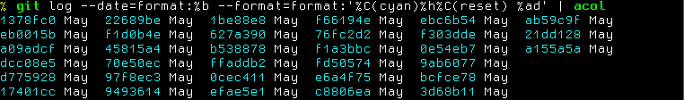

acol
====

[![Build Status][travis-badge]][travis-url]
[![Go Report Card][report-badge]][report-url]
[![MIT License][license-badge]](LICENSE.txt)

Styles standard input in a tabular format like `ls`.

- [Installation](#installation)
- [Testing](#installation)
- [Usage](#usage)
- [Alternatives](#alternatives)

[travis-badge]: https://travis-ci.org/frickiericker/acol.svg?branch=master
[travis-url]: https://travis-ci.org/frickiericker/acol
[report-badge]: https://goreportcard.com/badge/github.com/frickiericker/acol
[report-url]: https://goreportcard.com/report/github.com/frickiericker/acol
[license-badge]: http://img.shields.io/badge/license-MIT-blue.svg

## Installation

[Install Go](https://golang.org/doc/install) and run this command:

    go get github.com/frickiericker/acol

Now acol is placed in GOPATH/bin (which is ~/go/bin by default).

## Testing

Move to the repository root (or ~/go/github.com/frickiericker/acol) and

    go test ./...

## Usage

acol reads list of lines and formats the list into multiple columns. Like this:

    % head -n 30 /usr/share/dict/words | acol
    A      aam       Aaronic    Ab       abaca        abaciscus
    a      Aani      Aaronical  aba      abacate      abacist
    aa     aardvark  Aaronite   Ababdeh  abacay       aback
    aal    aardwolf  Aaronitic  Ababua   abacinate    abactinal
    aalii  Aaron     Aaru       abac     abacination  abactinally

Input may contain spaces and/or escape sequences (colored text):

### Options

    -h, --help   display help information
    -r           use row-major ordering
    -s[=2]       space between columns

## Alternatives

The [column command][man-column] works similarly to acol. However, it does not
handle colored text correctly. Also, the output of column is less packed than
that of acol because of uniform column width.

[man-column]: https://linux.die.net/man/1/column
